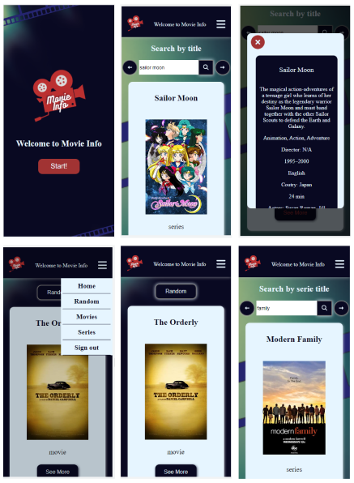
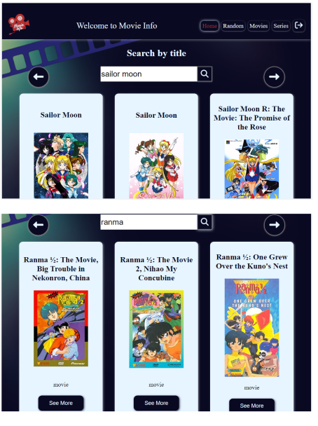
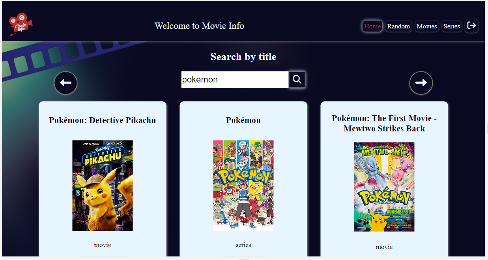

# Aplicación de busqueda de peliculas y series

 - [Accede a la app aqui!](https://flourishing-truffle-4a186a.netlify.app/)

 

#### La api que usé fue https://www.omdbapi.com/ 

 

#### En la aplicación puede realizar busqueda general o filtrar por peliculas, series o random, en random solo son peliculas. Tiene paginación y barra de navegación, en la versión celular tiene un menu desplegable.
 

## Imagenes de muestra de la App

<figure>
    <figcaption>Vista celular</figcaption>
    
</figure>

<figure>
    <figcaption>Vista Laptop</figcaption>
    
</figure>    

<figure>
    <figcaption>Vista PC</figcaption>
    
</figure>    

#### Esta aplicación la realicé usando:
- HTML
- Javascript
- CSS
- React
